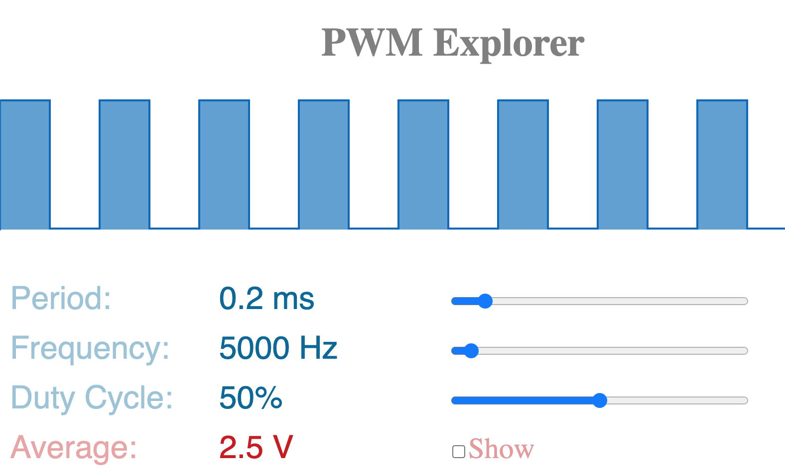

# PWM Explorer

An interactive visualization of Pulse Width Modulation (PWM).

## Instructions

Drag the sliders to set the period, frequency, and duty cycle. Click the checkbox to control whether the average voltage is shown.

## Related

[`map` explorer](https://osteele.github.io/map-explorer/) visualizes the
Arduino/Processing/p5.js `map()` function.

## License

MIT
